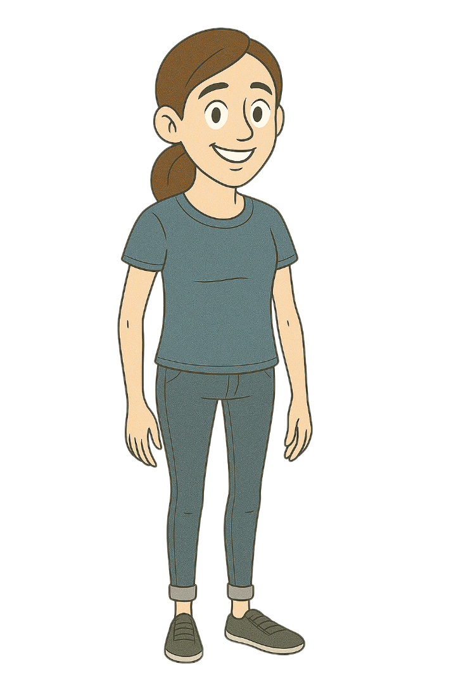
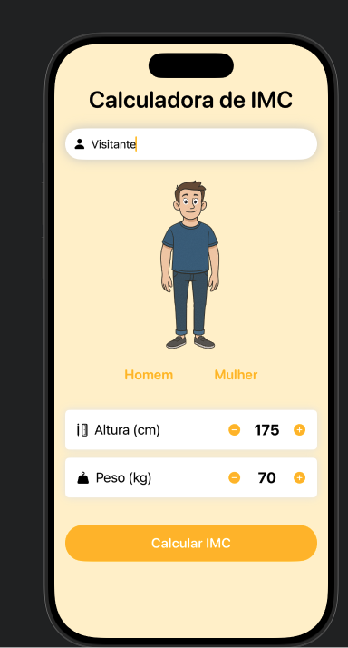
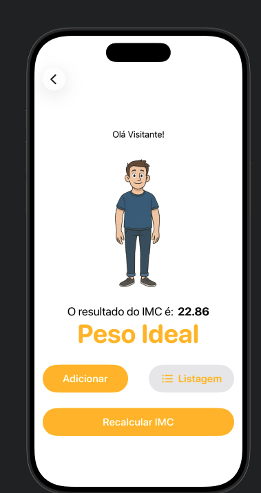
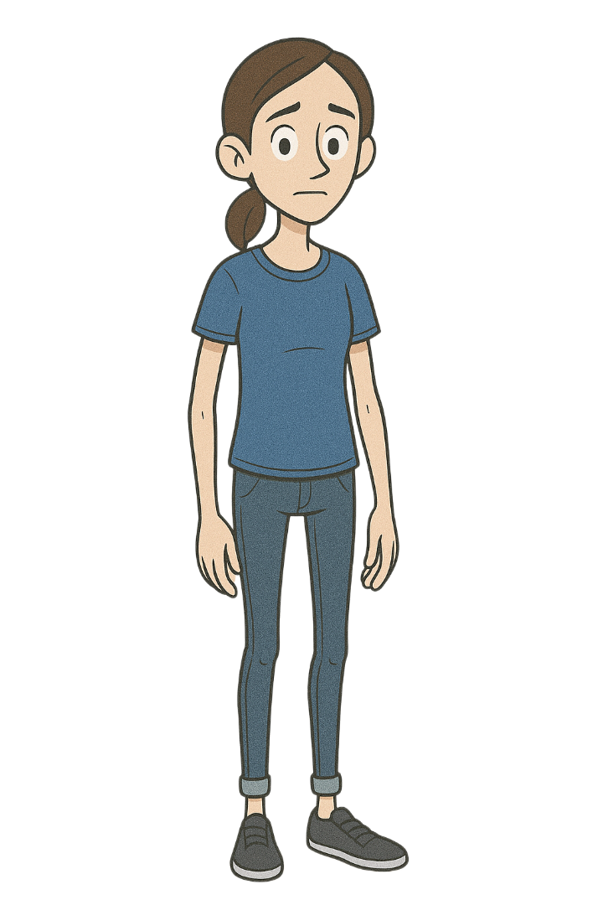
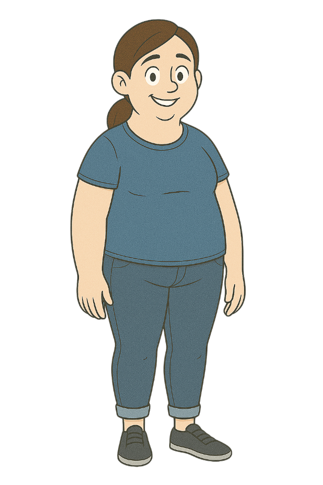

<h1 align="center">🧮 Calculadora de IMC</h1>

<p align="center">
  Um pequeno app iOS feito em <strong>SwiftUI</strong> para calcular o <strong>Índice de Massa Corporal (IMC)</strong>,<br>
  mostrar a classificação com uma ilustração e guardar um histórico dos resultados.
</p>

<p align="center">
  
  &nbsp;&nbsp;&nbsp;&nbsp;
  
</p>

---

## 📱 Telas

<p align="center">
  
  &nbsp;&nbsp;&nbsp;&nbsp;
  
</p>
<p align="center">
  <em>Tela inicial</em> &nbsp;•&nbsp; <em>Tela de resultado</em>
</p>

## ✨ Funcionalidades

- Campo para digitar o **nome**
- Seleção de **gênero** (Homem / Mulher), que troca a ilustração
- Ajuste de **altura** (cm) e **peso** (kg) com botões **–** e **+** (padrão: 175 cm / 70 kg)
- Cálculo do IMC e tela de **resultado** com classificação e ilustração correspondente
- **Adicionar** o resultado ao histórico (disponível quando o nome é preenchido)
- **Listagem** dos IMCs salvos, com opção de apagar deslizando o item
- Botão **Recalcular IMC** para voltar ao início

## 📐 Fórmula

```
IMC = peso (kg) / altura (m)²
```

No código, a altura é informada em centímetros:

```swift
let imc = Double(weight) / (Double(height * height) / 10000)
```

## 📊 Classificação

| IMC | Classificação | Homem | Mulher |
|:---:|:---|:---:|:---:|
| menor que 16 | Magreza |  |  |
| 16 a 18,5 | Abaixo do peso |  |  |
| 18,5 a 25 | Peso Ideal |  |  |
| 25 a 30 | Sobrepeso |  |  |
| 30 ou mais | Obesidade |  |  |

## 📋 Histórico

Os resultados adicionados ficam salvos no dispositivo usando `@AppStorage("lista_imc")`, com a lista codificada em JSON (`Codable`). Quando ainda não há nenhum IMC salvo, a tela de listagem mostra:

<p align="center">
  
  <br>
  <em>Nenhum IMC cadastrado</em>
</p>

## 🗂️ Estrutura do projeto

```
IMC/
├── IMCApp.swift        # Ponto de entrada do app
├── ContentView.swift   # NavigationStack e rotas de navegação
├── AppRoute.swift      # Rotas: resultado e listagem
├── HomeView.swift      # Tela inicial: nome, gênero, altura e peso
├── ResultView.swift    # Resultado do IMC e classificação
├── ListView.swift      # Histórico de IMCs salvos
├── MeasureView.swift   # Componente de medida com botões – / +
├── GenderButton.swift  # Botão de seleção de gênero
├── AppButton.swift     # Botão padrão do app
├── Gender.swift        # Enum de gênero
├── IMCStorage.swift    # Persistência do histórico (AppStorage + JSON)
└── Assets.xcassets     # Ilustrações e cores
```

## 🛠️ Tecnologias

- Swift 5
- SwiftUI
- `NavigationStack` + `NavigationPath`
- `@State`, `@Binding` e `@AppStorage`
- `Codable` (JSONEncoder / JSONDecoder)

## ▶️ Como executar

1. Tenha o **Xcode** instalado (versão com suporte a iOS 18 ou superior)
2. Clone o repositório
3. Abra o arquivo `IMC.xcodeproj`
4. Escolha um simulador de iPhone e pressione **⌘R**

## 👩‍💻 Autoria

Desenvolvido por **Raqueli**.
